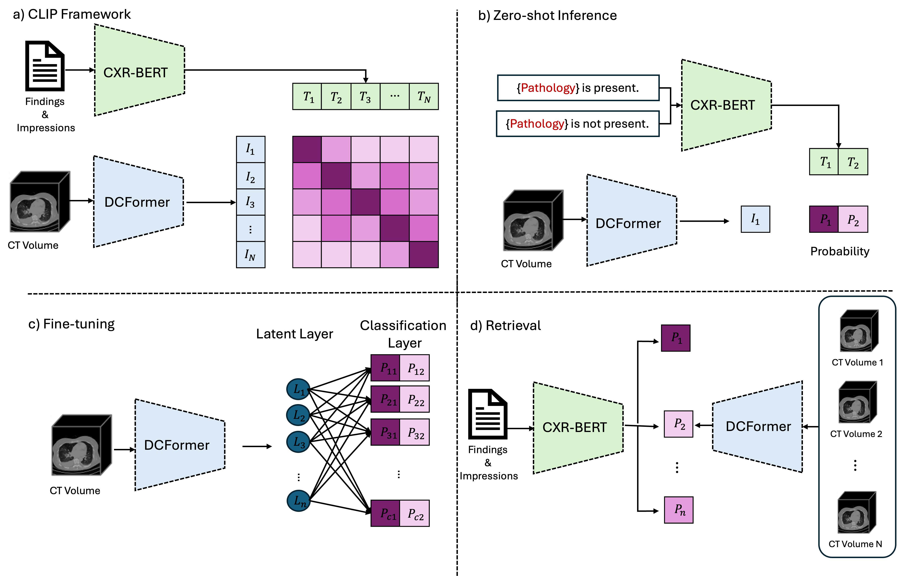

# 🧠 DCFormer: Efficient 3D Vision Encoder for Medical Vision-Language Models

Official PyTorch implementation of: 
[DCFormer: Efficient 3D Vision Encoder for Medical Vision-Language Models](https://arxiv.org/abs/2502.05091)


<div style="background-color: white; padding: 10px;">
  
</div>
---
## 📌 Abstract

Vision-language models (VLMs) have been widely applied to 2D medical image analysis due to their ability to align visual and textual representations. However, extending VLMs to 3D imaging remains computationally challenging. Existing 3D VLMs often rely on Vision Transformers (ViTs), which are computationally expensive due to the quadratic complexity of self-attention, or on 3D convolutions, which require large numbers of parameters and FLOPs as kernel size increases. We introduce DCFormer, an efficient 3D image encoder that factorizes 3D convolutions into three parallel 1D convolutions along the depth, height, and width dimensions. This design preserves spatial information while significantly reducing computational cost. Integrated into a CLIP-based vision-language framework, DCFormer is trained and evaluated on CT-RATE, a dataset of 50,188 paired 3D chest CT volumes and radiology reports. In zero-shot and fine-tuned detection of 18 pathologies, as well as in image–text retrieval tasks, DCFormer consistently outperforms state-of-the-art 3D vision encoders, including CT-ViT, ViT, ConvNeXt, PoolFormer, and TransUNet. These results highlight DCFormer’s potential for scalable, clinically deployable 3D medical VLMs.

---

## 🏗️ Model Architecture

- ✅ **Decomposed 3D Convolutions**: 3 × 1D convs along D, H, W
- ✅ **Low computation & memory efficient**
- ✅ **Compatible with VLMs like CLIP**
- ✅ **Trained on 50k+ chest CT scans**

---

### 📊 Results Summary

> **Zero-shot performance of models trained on the CT-RATE dataset at the resolution of 512×512×256.**

| Model       | Variant | Params (M) | GFLOPS | Accuracy (%) | F1 Score (%) | Precision (%) | Recall (%) |
|-------------|---------|------------|--------|---------------|----------------|----------------|--------------|
| DCFormer    | nano    | 0.92       | 34.21  | 60.4          | 41.9           | 27.2           | 62.8         |
| DCFormer    | naïve   | 5.85       | 49.48  | 63.1          | 44.5           | 29.5           | 65.5         |
| DCFormer    | tiny    | 15.1       | 168.2  | 62.0          | 46.3           | 29.7           | 70.1         |
| ConvNeXt    | nano    | 3.19       | 31.92  | 62.2          | 39.4           | 26.7           | 55.1         |
| ConvNeXt    | naïve   | 15.63      | 96.84  | 60.7          | 42.4           | 27.7           | 63.8         |
| ConvNeXt    | tiny    | 31.59      | 156.31 | 62.5          | 42.1           | 28.2           | 60.1         |
| PoolFormer  | nano    | 2.79       | 27.14  | 60.2          | 37.0           | 24.8           | 52.3         |
| PoolFormer  | naïve   | 11.31      | 63.75  | 60.1          | 39.1           | 25.7           | 56.8         |
| PoolFormer  | tiny    | 20.68      | 117.46 | 61.8          | 38.3           | 26.0           | 53.5         |
| TransUNet   | naïve   | 12.48      | 118.9  | 58.6          | 41.4           | 26.5           | 56.0         |
| TransUNet   | tiny    | 23.93      | 207.5  | 61.5          | 35.8           | 24.7           | 48.7         |
| ViT         | naïve   | 11.10      | 39.05  | 55.0          | 42.5           | 25.8           | 71.5         |
| ViT         | tiny    | 26.34      | 86.43  | 61.0          | 43.2           | 28.0           | 64.8         |
| CTViT       | -       | 101.1      | 160.5  | 62.9          | 44.3           | 29.3           | 65.7         |

> **Fine-tuning performance of models trained on the CT-RATE dataset at the resolution of 512×512×256.**

| Model       | Variant | Params (M) | GFLOPS | Accuracy (%) | F1 Score (%) | Precision (%) | Recall (%) |
|-------------|---------|------------|--------|---------------|----------------|----------------|--------------|
| DCFormer    | nano    | 0.92       | 34.21  | 60.1          | 45.0           | 28.6           | 69.6         |
| DCFormer    | naïve   | 5.85       | 49.48  | 64.2          | 47.2           | 31.0           | 70.2         |
| DCFormer    | tiny    | 15.1       | 168.2  | 64.1          | 48.6           | 31.4           | 72.9         |
| ConvNeXt    | nano    | 3.19       | 31.92  | 56.3          | 43.5           | 26.2           | 70.1         |
| ConvNeXt    | naïve   | 15.63      | 96.84  | 59.0          | 44.2           | 27.2           | 67.6         |
| ConvNeXt    | tiny    | 31.59      | 156.31 | 60.4          | 44.8           | 28.2           | 68.2         |
| PoolFormer  | nano    | 2.79       | 27.14  | 52.6          | 41.2           | 24.1           | 67.6         |
| PoolFormer  | naïve   | 11.31      | 63.75  | 53.9          | 41.9           | 24.8           | 68.7         |
| PoolFormer  | tiny    | 20.68      | 117.46 | 54.2          | 42.2           | 25.0           | 68.8         |
| TransUNet   | naïve   | 12.48      | 118.9  | 60.2          | 44.6           | 29.4           | 70.1         |
| TransUNet   | tiny    | 23.93      | 207.5  | 50.2          | 39.4           | 22.7           | 66.1         |
| ViT         | naïve   | 11.10      | 39.05  | 56.2          | 43.1           | 26.1           | 69.8         |
| ViT         | tiny    | 26.34      | 86.43  | 59.4          | 44.9           | 28.0           | 70.8         |
| CTViT       | -       | 101.1      | 160.5  | 61.8          | 46.4           | 29.4           | 70.1         |

> **Performance of models trained on the CT-RATE dataset at the resolution of 512×512×256.**  
> *IR = Image Retrieval, TR = Text Retrieval; R@K = Recall at K.*

| Model      | Variant | IR R@1 | IR R@10 | IR R@50 | TR R@1 | TR R@10 | TR R@50 |
|------------|---------|--------|---------|---------|--------|---------|---------|
| DCFormer   | nano    | 0.0001 | 0.0135  | 0.0617  | 0.0001 | 0.0135  | 0.0707  |
| DCFormer   | naive   | 0.0026 | 0.0220  | 0.0954  | 0.0016 | 0.0214  | 0.0971  |
| DCFormer   | tiny    | 0.0053 | 0.0296  | 0.1131  | 0.0039 | 0.0280  | 0.1237  |
| ConvNeXt   | nano    | 0.0013 | 0.0102  | 0.0562  | 0.0029 | 0.0135  | 0.0599  |
| ConvNeXt   | naive   | 0.0016 | 0.0161  | 0.0780  | 0.0023 | 0.0214  | 0.0740  |
| ConvNeXt   | tiny    | 0.0026 | 0.0135  | 0.0694  | 0.0010 | 0.0171  | 0.0796  |
| PoolFormer | nano    | 0.0016 | 0.0095  | 0.0480  | 0.0023 | 0.0164  | 0.0592  |
| PoolFormer | naive   | 0.0013 | 0.0134  | 0.0569  | 0.0026 | 0.0151  | 0.0635  |
| PoolFormer | tiny    | 0.0007 | 0.0171  | 0.0638  | 0.0016 | 0.0115  | 0.0648  |
| TransUNet  | naive   | 0.0023 | 0.0236  | 0.1000  | 0.0033 | 0.0269  | 0.1105  |
| TransUNet  | tiny    | 0.0016 | 0.0131  | 0.0589  | 0.0026 | 0.0151  | 0.0651  |
| ViT        | naive   | 0.0016 | 0.0112  | 0.0500  | 0.0007 | 0.0109  | 0.0563  |
| ViT        | tiny    | 0.0010 | 0.0167  | 0.0628  | 0.0013 | 0.0148  | 0.0737  |
| CTViT      | -       | 0.0046 | 0.0293  | 0.1096  | 0.0023 | 0.0260  | 0.0921  |
---

> 📄 Full results in the [paper](https://arxiv.org/abs/2502.05091).

---

## 📂 **[[Dataset: CT-RATE]](https://huggingface.co/datasets/ibrahimhamamci/CT-RATE)**

- 50,188 reconstructed 3D CT volumes
- Paired with radiology reports
- 18 expert-annotated pathology labels

---

## Training

### CLIP Pretraining
To train the DCFormer based CLIP model, use the following command:

```bash
sh dcformer.sh
```

## References
The code is mainly adapted from [CT-CLIP](https://github.com/ibrahimethemhamamci/CT-CLIP/tree/main).


## Citations and Acknowledgements
The code is only for research purposes. If you have any questions regarding how to use this code, feel free to contact Gorkem Can Ates at g.canates@gmail.com.

Kindly cite the following papers if you use our code.

```bibtex
@article{ates2025dcformer,
  title={DCFormer: Efficient 3D Vision-Language Modeling with Decomposed Convolutions},
  author={Ates, Gorkem Can and Gong, Kuang and Shao, Wei},
  journal={arXiv preprint arXiv:2502.05091},
  year={2025}
}
@article{hamamci2024developing,
  title={Developing Generalist Foundation Models from a Multimodal Dataset for 3D Computed Tomography},
  author={Hamamci, Ibrahim Ethem and Er, Sezgin and Almas, Furkan and Simsek, Ayse Gulnihan and Esirgun, Sevval Nil and Dogan, Irem and Dasdelen, Muhammed Furkan and Durugol, Omer Faruk and Wittmann, Bastian and Amiranashvili, Tamaz and others},
  journal={arXiv preprint arXiv:2403.17834},
  year={2024}
}

```

